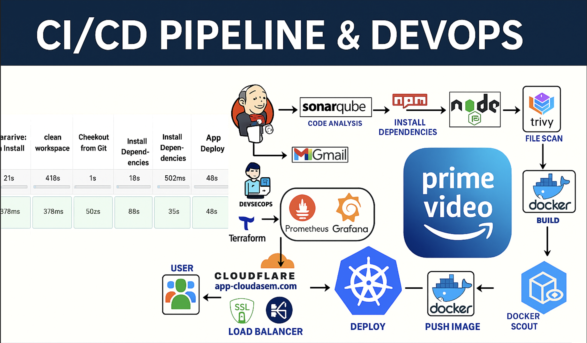

# CI/CD Automation Pipeline 🚀
  


This repository automates infrastructure provisioning, application deployment, and monitoring using:

- **Terraform** for IaaS
- **Jenkins** for CI/CD
- **Docker** for containerization
- **EKS (Kubernetes)** for orchestration
- **Prometheus & Grafana** for monitoring
- **Trivy** for image security scanning

---

## 📂 Directory Structure
.
├── monitoring/
│ └── Promethues.yml # (Note: should be Prometheus.yml)
├── public/
├── scripts/ # All setup/install scripts
│ ├── awscli.sh
│ ├── docker.sh
│ ├── eksctl.sh
│ ├── grafana.sh
│ ├── jenkins.sh
│ ├── kubectl.sh
│ ├── permissionexecute.sh
│ ├── prometheus.sh
│ ├── terraform.sh
│ └── trivy.sh
├── src/ # Source code
├── terraform/ # IaC for AWS infra (EKS, etc.)
│ ├── main.tf
│ ├── output.tf
│ └── variables.tf
├── Dockerfile
├── Jenkinsfile
├── Jenkinsfile2-eks
├── package.json
├── package-lock.json
└── README.md

---

## ⚙️ Setup Instructions

### 1. 🔓 Make Scripts Executable

```bash
chmod +x scripts/*.sh
```

### 2. 🔧 Install Tools via Scripts
./scripts/awscli.sh        # Install & configure AWS CLI
./scripts/docker.sh        # Install Docker
./scripts/terraform.sh     # Install Terraform
./scripts/kubectl.sh       # Install kubectl
./scripts/eksctl.sh        # Install eksctl for EKS
./scripts/jenkins.sh       # Install Jenkins
./scripts/prometheus.sh    # Setup Prometheus
./scripts/grafana.sh       # Setup Grafana
./scripts/trivy.sh         # Setup Trivy scanner

### ☁️ Infrastructure Provisioning (Terraform)
```sh 
cd terraform
terraform init
terraform apply

```
---
### 🔁 CI/CD Pipeline Setup (Jenkins)
1. Access Jenkins UI.
2. Create a Pipeline job.
3. Use either Jenkinsfile or Jenkinsfile2-eks depending on your flow.
**Jenkinsfile** handles build + deploy.**
**Jenkinsfile2-eks** handles direct EKS deployment.

### 🔍 Security Scanning
```sh
./scripts/trivy.sh

```

### 📈 Monitoring Stack
Prometheus config is in: **monitoring/Promethues.yml**
(Rename to **Prometheus.yml** if needed)
```sh
./scripts/prometheus.sh    # Start Prometheus
./scripts/grafana.sh       # Start Grafana
```
Access Grafana on **http://localhost:3000** and import Prometheus as data source.

### 📝 Notes
AWS credentials must be configured (**~/.aws/credentials**)
EKS cluster name and region must match between Terraform and **eksctl**
All tools/scripts are portable and modular
---
### 🤝 Contributing
PRs are welcome. For major changes, open an issue first to discuss what you’d like to change.
